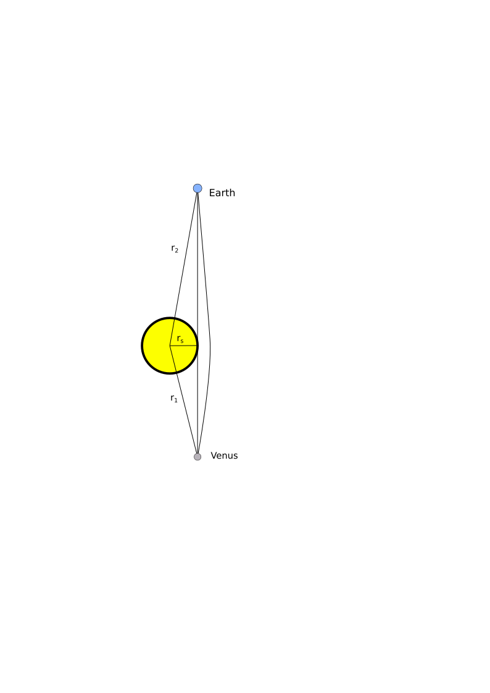

```{r setup, include=FALSE}
knitr::opts_chunk$set(echo = TRUE)
source("mercury.R")
source("usefulfuncs.R")
source("usefulgeodesicfuncs.R")
```

## Summary

The Shapiro delay is one of the classical tests of general relativity.
In this unfinished document I use direct numerical simulation to
verify the predictions of GR.


## Introduction 

Shapiro delay blah blah blah


First some setups:
```{r}
source("usefulnullgeodesicfuncs.R")
```


Schwarzschild radius of sun:

```{r}
r_s
```

```{r}
r0 <- r_sun/r_s # grazing incidence of the sun in Schwarzschild radii
r0
```

Thus the radius of the sun is about 471000 Schwarzschild radii.
 


```{r}

b_radial <- r0/sqrt(1-1/r0) 
r0
b_radial
small <- 1e-10 # needed to prevent numerical problems

d_earth <-
seq(from=orbital_radius_earth/r_s * 0.999, to=orbital_radius_earth/r_s * 1.001,len=100)

d_venus <- 
seq(from=orbital_radius_venus/r_s * 0.999, to=orbital_radius_venus/r_s * 1.001,len=100)

d_earth <- c(1:10,d_earth)
```


Now calculate a null geodesic starting from the sun and ending at earth's orbit:

```{r}
out_earth <- nullgeodesic(r_start=r0,b=b_radial*(1-small),tau=c(0,d_earth))
head(out_earth)
tail(out_earth)
```

(function `nullgeodesic()` is a general-purpose solver for the path
light takes in the Schwarzschild metric; see file
`light_start_at_r_equals_2.R` for a more visually appealing simulation
than presented here, and `light_start_at_radius_of_sun.R` for a
discussion of the bending of starlight by the sun during an eclipse,
as (e.g.) measured by Eddington in 1919).  Above, see how the path
starts at $t=0$ at a location given by the radius of the sun (the `r`
column) and angle $\phi=0$ (the `phi` column).  We can perform the
same calculation but for Venus:

```{r}
out_venus <- nullgeodesic(r_start=r0,b=b_radial*(1-small),tau=c(0,d_venus))
```

The next step is to approximate the function

```{r}
f_earth <- approxfun(out_earth$r,out_earth$time)
f_venus <- approxfun(out_venus$r,out_venus$time)
```

```{r}
st <- function(x){(x-min(x))/(max(x)-min(x))}
plot(out_earth$x,out_earth$y,type='o',col='red',cex=st(out_earth$time),asp=1)
event_horizon()
```


So now `f_earth(t)` gives the time required to achieve a particular
radius.  Thus to calculate the transit time from Earth to Venus (NB:
one way!) we simply add the times to get to the Earth's radius to
Venus's:

```{r}
transit_time_relativistic  <- 
(f_earth(orbital_radius_earth/r_s) + f_venus(orbital_radius_venus/r_s))*r_s/sol

transit_time_relativistic  # transit time in seconds
```

Now we calculate the classical time.  The naive estimate would be

```{r}
transit_time_classical <- (orbital_radius_earth + orbital_radius_venus)/sol # seconds
```

but this neglects the fact that the light path starts at grazing
incidence (note that the relativistic path does not graze the sun but
actually grazes radius $r_s+2MG/c^2$, but this is the same to first
order).

{width=700px}


```{r}
distance_grazing_to_earth <- sqrt(orbital_radius_earth^2 - r_sun^2)
distance_grazing_to_venus <- sqrt(orbital_radius_venus^2 - r_sun^2)
transit_time_classical <- (distance_grazing_to_earth + distance_grazing_to_venus)/sol
transit_time_classical
```

Then the Shapiro delay is just the difference:

```{r}
shapiro_delay <- (transit_time_classical - transit_time_relativistic)*2
shapiro_delay
```

(we multiply by two because the radar had an outward and return leg,
to Venus and back).  Compare this with the measured effect of 200
microseconds:

```{r}
shapiro_delay/200e-6
```
